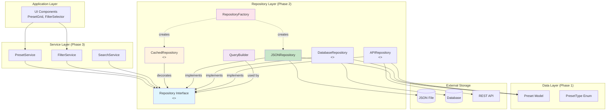
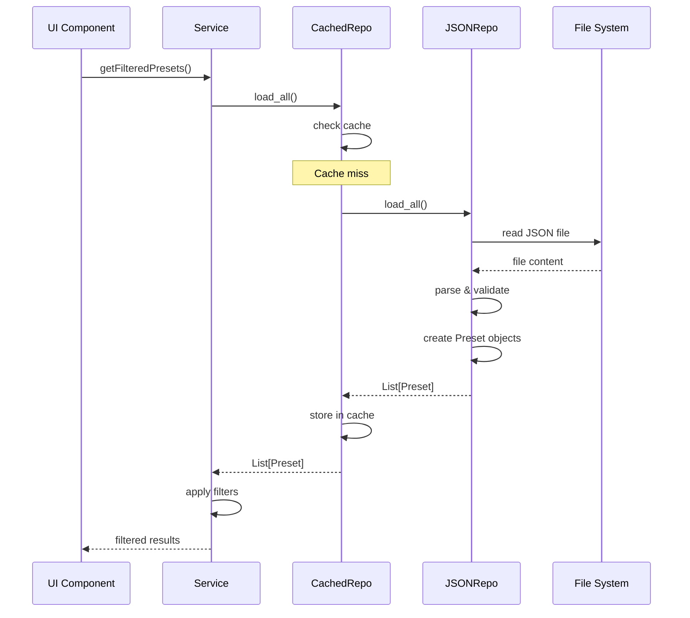
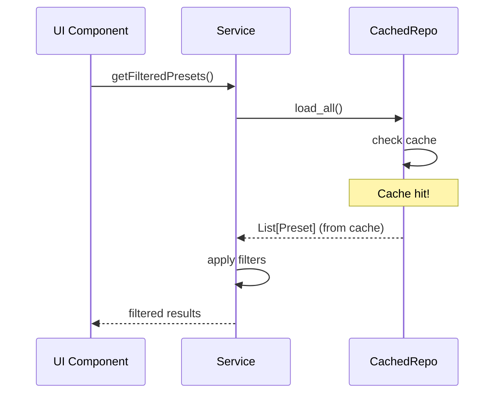
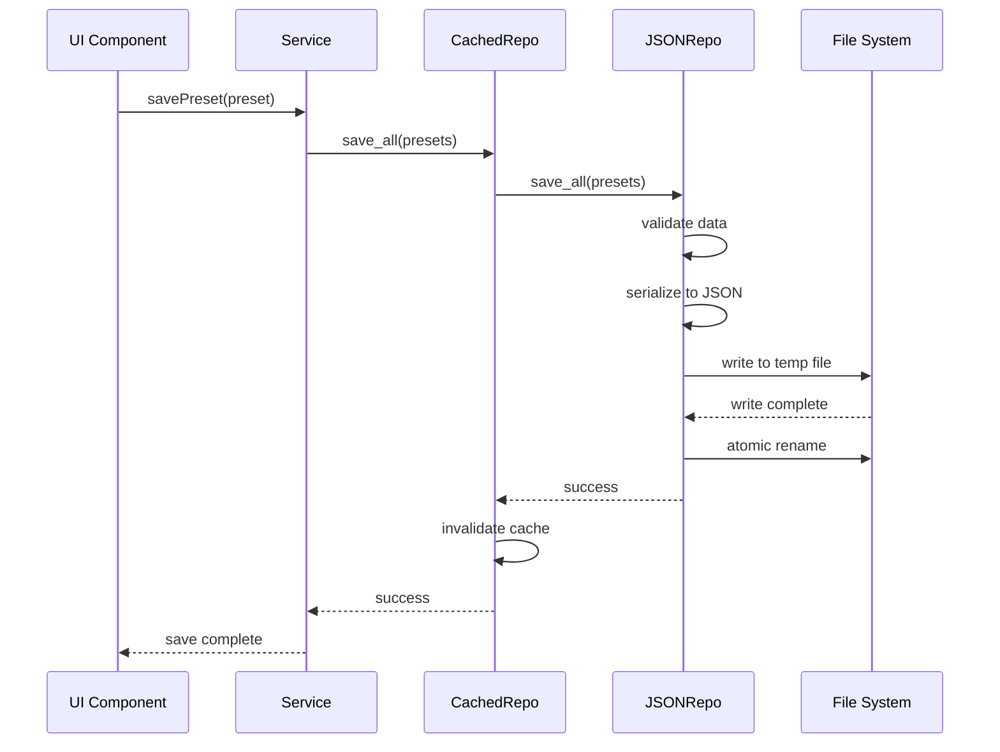

# Phase 2: Repository Pattern Architecture

## Visual Architecture Overview



## Component Responsibilities

### Repository Interface (Abstract Base)
```python
class PresetRepository(ABC):
    """Defines contract for all repository implementations"""
    
    @abstractmethod
    async def load_all() -> List[Preset]
    
    @abstractmethod
    async def load_by_id(cc0: int, pgm: int) -> Optional[Preset]
    
    @abstractmethod
    async def save_all(presets: List[Preset]) -> None
```

### JSON Repository (Concrete Implementation)
```python
class JSONPresetRepository(PresetRepository):
    """File-based storage implementation"""
    
    - Async file I/O
    - Schema validation
    - Atomic writes
    - Error handling
```

### Cached Repository (Decorator Pattern)
```python
class CachedRepository(PresetRepository):
    """Adds caching to any repository"""
    
    - LRU cache with TTL
    - Cache statistics
    - Invalidation strategies
    - Memory management
```

### Query Builder (Fluent Interface)
```python
class QueryBuilder:
    """Build complex queries programmatically"""
    
    query = QueryBuilder()
        .with_pack("factory")
        .with_type("bass")
        .with_search("warm")
        .limit(10)
```

## Data Flow Sequences

### 1. Loading Presets (Cache Miss)


### 2. Loading Presets (Cache Hit)


### 3. Saving Presets


## Cache Strategy

### Cache Layers
```
┌─────────────────────────────────────────┐
│          Query Results Cache            │
│         (Complex filter results)        │
├─────────────────────────────────────────┤
│           Entity Cache                  │
│        (Individual presets)             │
├─────────────────────────────────────────┤
│          Collection Cache               │
│         (Full preset list)              │
├─────────────────────────────────────────┤
│           Metadata Cache                │
│    (Packs, types, characters lists)     │
└─────────────────────────────────────────┘
```

### Cache Invalidation Rules

| Operation | Invalidates |
|-----------|------------|
| `save_all()` | All caches |
| `update_preset()` | Specific preset + collections |
| `delete_preset()` | Specific preset + collections |
| TTL expiration | Individual entry |
| Memory pressure | LRU entries |

## Error Handling Hierarchy

```
RepositoryError
├── DataNotFoundError
│   ├── FileNotFoundError
│   └── PresetNotFoundError
├── DataAccessError
│   ├── PermissionError
│   ├── NetworkError
│   └── TimeoutError
└── DataValidationError
    ├── SchemaValidationError
    ├── MissingFieldError
    └── InvalidValueError
```

## Performance Characteristics

### Time Complexity

| Operation | Without Cache | With Cache (Hit) | With Cache (Miss) |
|-----------|--------------|------------------|-------------------|
| `load_all()` | O(n) | O(1) | O(n) |
| `load_by_id()` | O(n) | O(1) | O(n) |
| `load_by_pack()` | O(n) | O(1) | O(n) |
| `save_all()` | O(n) | O(n) | O(n) |
| Query Builder | O(n×m) | O(1) | O(n×m) |

Where:
- n = number of presets
- m = number of filter conditions

### Space Complexity

| Component | Space Usage |
|-----------|------------|
| JSON Repository | O(n) - full dataset in memory during operations |
| Cached Repository | O(k) - where k is cache size limit |
| Query Builder | O(1) - minimal overhead |
| Preset Model | O(n) - linear with dataset size |

## Configuration Options

### Repository Configuration
```yaml
repository:
  type: json
  file_path: "OsmosePresets.json"
  validate_schema: true
  encoding: utf-8
  
cache:
  enabled: true
  ttl_seconds: 300
  max_entries: 100
  eviction_policy: lru
  enable_stats: true
  
performance:
  batch_size: 100
  async_io: true
  connection_pool_size: 5
```

### Environment-Specific Settings

| Environment | Cache TTL | Max Cache | Validation |
|------------|-----------|-----------|------------|
| Development | 60s | 50 | Full |
| Testing | 0s (disabled) | 0 | Full |
| Staging | 300s | 100 | Full |
| Production | 3600s | 500 | Minimal |

## Migration Path

### Phase 2A: Parallel Implementation
- Repository interfaces created
- JSON implementation complete
- Tests passing
- Old PresetData still active

### Phase 2B: Adapter Layer
```python
# Temporary adapter for backward compatibility
class PresetDataAdapter:
    def __init__(self, repository: PresetRepository):
        self._repo = repository
    
    @staticmethod
    def get_presets():
        # Delegate to repository
        return asyncio.run(repo.load_all())
```

### Phase 2C: Complete Migration
- All components use repository
- PresetData removed
- Full async/await throughout
- Performance optimized

## Testing Strategy

### Unit Tests
- Mock repository for service tests
- Test cache hit/miss scenarios
- Verify error handling
- Check query builder logic

### Integration Tests
- Real file I/O testing
- Cache behavior validation
- Concurrent access testing
- Performance benchmarks

### Load Tests
- 10,000+ presets
- 100+ concurrent requests
- Cache effectiveness
- Memory usage monitoring

## Future Extensions

### 1. Multi-tier Caching
```
Application → L1 Cache (Memory) → L2 Cache (Redis) → Repository
```

### 2. Read-Through/Write-Through Cache
- Automatic cache population
- Transparent write propagation
- Background refresh

### 3. Repository Plugins
- Audit logging
- Metrics collection
- Data transformation
- Encryption/decryption

### 4. Advanced Querying
- Full-text search
- Fuzzy matching
- Regular expressions
- SQL-like syntax

## Success Metrics

| Metric | Target | Measurement |
|--------|--------|-------------|
| Cache hit rate | > 80% | Via cache stats |
| Query response time | < 10ms (cached) | Performance monitoring |
| Memory usage | < 100MB | Resource monitoring |
| Test coverage | > 90% | Coverage reports |
| Error rate | < 0.1% | Error logs |

## Key Decisions

### Why Async?
- Non-blocking I/O for better performance
- Supports concurrent operations
- Future-proof for network operations
- Compatible with modern Python frameworks

### Why Repository Pattern?
- Separation of concerns
- Testability
- Flexibility to change storage
- Consistent data access API

### Why Decorator for Caching?
- Single Responsibility Principle
- Can add/remove caching without changing repository
- Reusable across different repositories
- Configurable per instance

### Why Query Builder?
- Type-safe query construction
- Reusable query logic
- Prevents SQL injection-like issues
- Self-documenting code